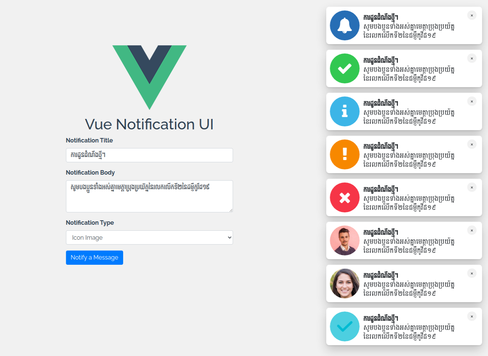

Vue Notification UI
------------------



A simple notification ui with Vuejs

## Installation

```
npm install vue-notification-ui --save
```

## Usage

```javascript
import Vue from 'vue'
import notification from 'vue-notification-ui'

Vue.use(notification, {
  position: 'notification-top-right', // top, bottom, left, right
  duration: 5000, // default
  left: 20, // default
  bottom: 20, // default
  top: 20, // default
  right: 40 // default
})


// call $notification api
this.$notification(
  'Good job!', 
  'You clicked the button!',
  'success', 
  async () => {
    console.log('Clicked notification')
  }, 
  'A minute ago'
)
```

## Notification options

| params | default | description  |
| ----- | ----- | ----- |
| title | string: `required: true` |  |
| body | string: `required: true` |  |
| icon | string: `optional` | - absolute file image <br/> - success <br/> - info <br/> - warning <br/> - danger |
| callback | function: `optional` | |
| time | string: `optional` | A minutes ago |
