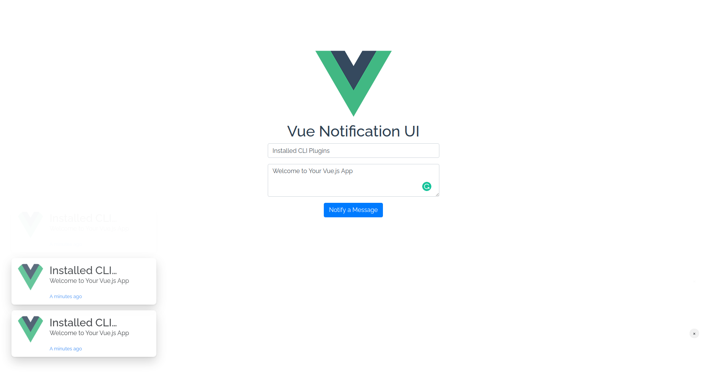

Vue Notification UI
------------------



A simple push the notification ui with Vuejs

## Installation

```
npm install vue-notification-ui --save
```

## Usage

```javascript
import Vue from 'vue'
import notification from 'vue-notification-ui'

Vue.use(notification, {
  position: 'notification-bottom-left',
  duration: 5000
})


// call $notification api
this.$notification('Vue Notification UI', 'A simple push the notification ui with Vuejs')
```
